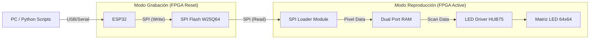
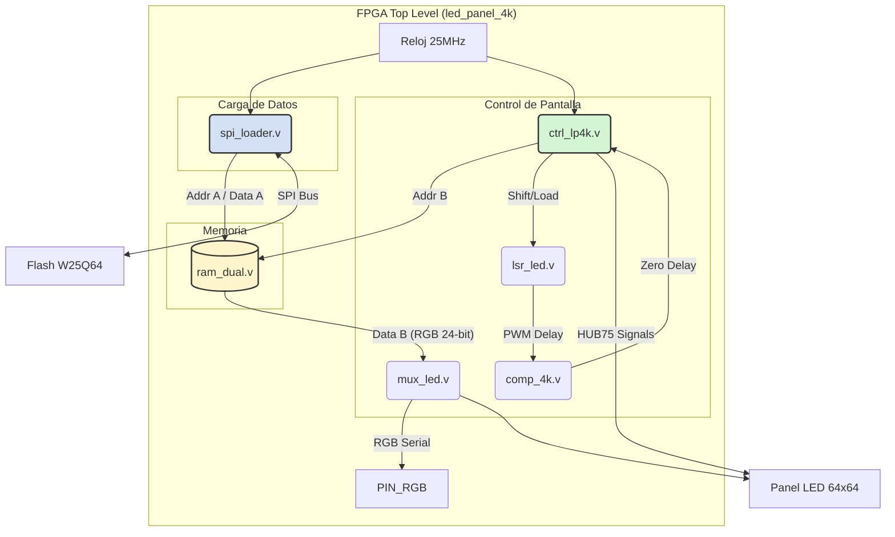
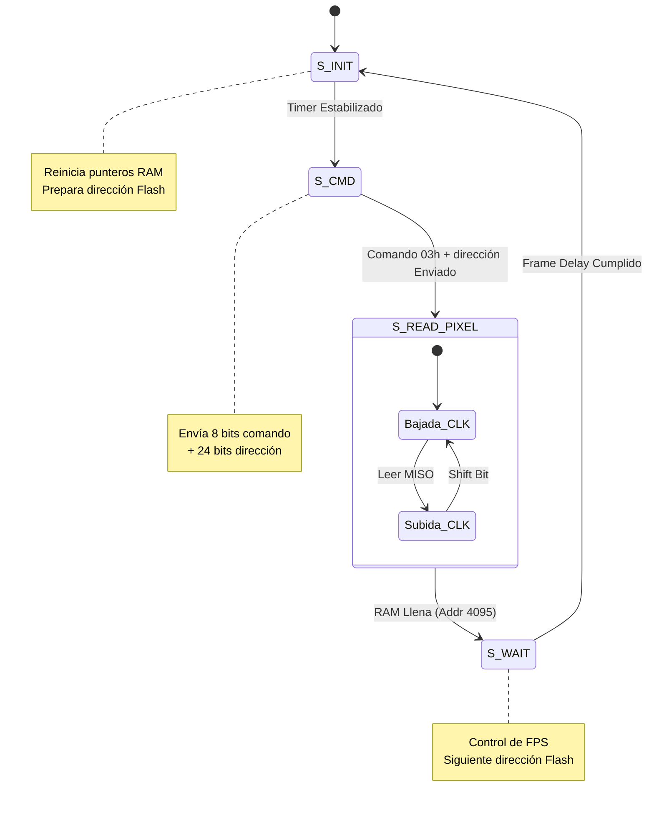
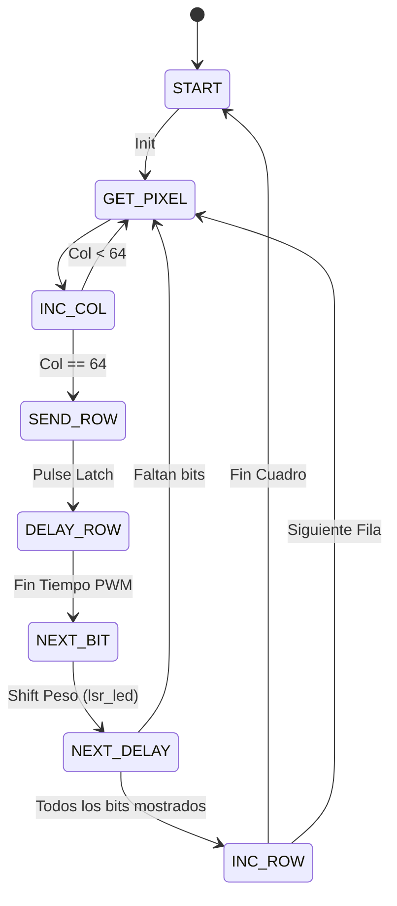
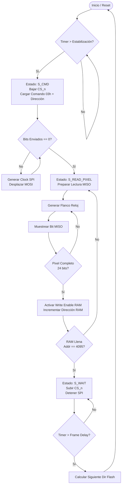
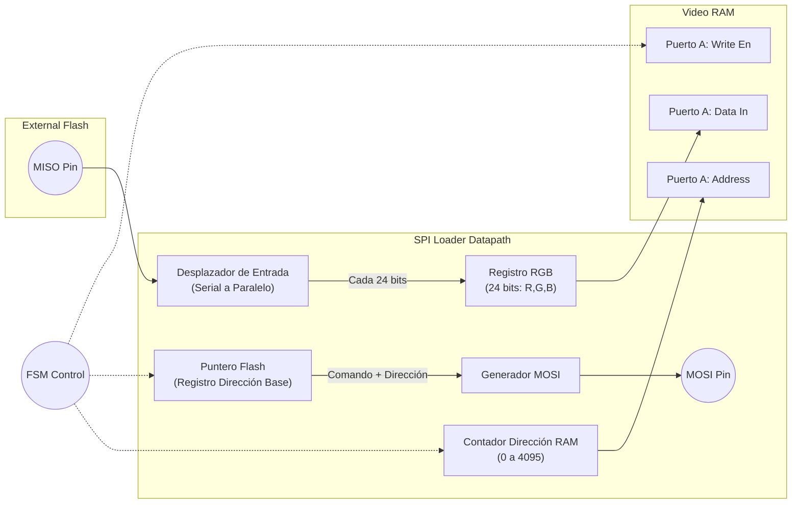
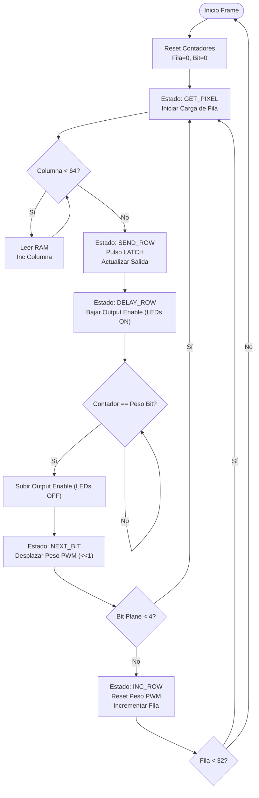
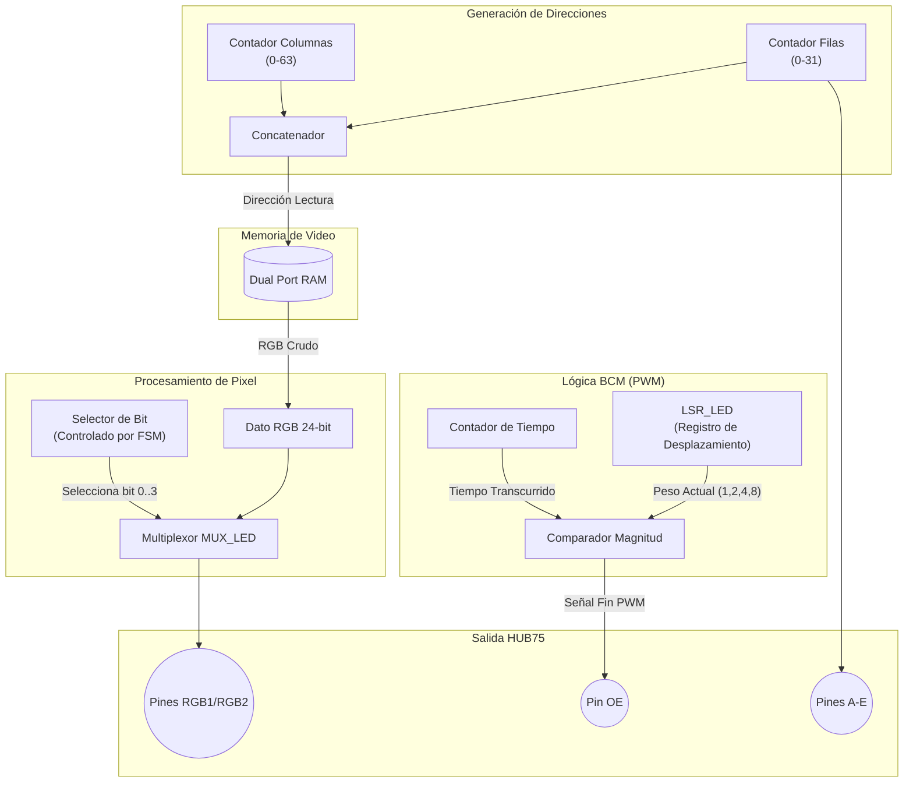

# Documentación
**Integrantes:**  
| Nombre Completo | Identificación (SIA) | Correo intitucional |
|-----------------|----------------------|----------------|
| David Ricardo Villarreal Archila     | 1005154067              | [dvillarreal@unal.edu.co](dvillareal@unal.edu.co)|
| Juan Felipe Arias Ruiz   | 1001077136          | [juariasru@unal.edu.co](juariasru@unal.edu.co)|
|Laura Camila Barrera León | 1016942896 | [labarreral@unal.edu.co](labarreral@unal.edu.co)
---

**Plataforma:** Lattice ECP5 (Colorlight i9)
**Lenguajes:** Verilog, python, C++
**Programador:** ESP32 (SPI Bridge)

---

## 0. Requisitos del Sistema

### 0.1 Hardware
1.  **FPGA Board:** Colorlight i9 (Lattice LFE5U-45F).
2.  **Display:** Matriz LED 64x64 RGB (Driver HUB75E, Scan 1/32).
3.  **Memoria:** Winbond W25Q128JV (128MB SPI Flash).
4.  **Programador:** ESP32 Development Board (DOIT DevKit V1 o similar).
5.  **Conectividad:** Cables Dupont (Hembra-Hembra/Macho) para conexión SPI.

### 0.2 Software y Toolchain
1.  **Síntesis HDL:** Yosys (Síntesis), Nextpnr-ecp5 (Place & Route), Project Trellis (Bitstream).
2.  **Firmware ESP32:** Arduino IDE con soporte para ESP32.
3.  **Scripts de Host (PC):** Python 3.8+ (Librería `pyserial`).


---

## 1. Introducción y Arquitectura General

Este sistema implementa un controlador de video para paneles LED HUB75 de 64x64 píxeles. La arquitectura se basa en un diseño **Productor-Consumidor** desacoplado mediante una memoria de doble puerto.

* **Productor (SPI Loader):** Lee datos crudos desde la memoria Flash SPI externa y llena el buffer de video.
* **Consumidor (LED Driver):** Lee el buffer de video y genera las señales de refresco HUB75 con modulación BCM (Binary Code Modulation) para lograr profundidad de color de 12 bits.

### 1.1 Diagrama de Bloques (Top Level)
Estra es la estructura general del proyecto.


El módulo principal `led_panel_4k` orquesta la conexión entre los submódulos.



---

## 2. Descripción Detallada de Módulos

### 2.1 Módulo `spi_loader.v` (Maestro SPI)

Este módulo es responsable de traer las imágenes desde la memoria no volátil a la RAM interna.

* **Dirección Base:** `0x300000` (Inicio de animaciones de usuario).
* **Tamaño de Frame:** 12,288 bytes (64x64 píxeles * 3 bytes de color / 2 mitades empacadas).
* **Lógica de Lectura:** Implementa un protocolo SPI Modo 0 manual (bit-banging sincronizado con reloj del sistema) para enviar el comando `03h` (Read Data).

#### Diagrama de Estados (FSM) - spi_loader



### 2.2 Módulo `ctrl_lp4k.v` (Controlador HUB75)

Gestiona el barrido de la pantalla y la modulación de color. Utiliza una técnica de **Bitplanes** (Planos de bits), donde la imagen se dibuja 4 veces consecutivas con diferentes tiempos de exposición (x1, x2, x4, x8) para formar 16 niveles de brillo por canal (12 bits de color total).

* **Señales de Control:** `LATCH`, `NOE` (Output Enable), `CLK` (Reloj de datos).
* **Secuencia:**
    1.  Carga una fila completa de datos (`GET_PIXEL` -> `INC_COL` loop).
    2.  Engancha los datos (`SEND_ROW` / Latch).
    3.  Enciende la pantalla por un tiempo variable (`DELAY_ROW`).
    4.  Pasa al siguiente peso de bit (`NEXT_BIT`).

#### Diagrama de Estados (FSM) - ctrl_lp4k



### 2.3 Módulos Auxiliares

* **`ram_dual.v`**: Memoria RAM de doble puerto real. Permite que el `spi_loader` escriba en el puerto A mientras el `ctrl_lp4k` lee del puerto B simultáneamente.
* **`mux_led.v`**: Multiplexor que selecciona qué bit del color RGB (bit 0, 1, 2 o 3) se envía al panel en el ciclo actual, dependiendo de la fase de la modulación PWM.
* **`lsr_led.v`**: Registro de desplazamiento que genera los valores de retardo potencias de 2 (1, 2, 4, 8...) para la comparación PWM. Se desplaza a la izquierda (`<< 1`) cada vez que se completa un plano de bits.

---

## 3. Interfaz de Hardware y Pinout

### Conexión HUB75 (Panel LED)
Estas señales son generadas por la FPGA hacia el panel.

| Señal | Verilog | Descripción |
| :--- | :--- | :--- |
| **R1, G1, B1** | `RGB0[2:0]` | Datos de color para la mitad superior (Filas 0-31). |
| **R2, G2, B2** | `RGB1[2:0]` | Datos de color para la mitad inferior (Filas 32-63). |
| **A, B, C, D, E** | `ROW[4:0]` | Dirección de línea activa (Decodificador 1:32). |
| **CLK** | `LP_CLK` | Reloj de desplazamiento de datos (Shift Clock). |
| **LAT** | `LATCH` | Latch de datos (Actualiza la salida del registro). |
| **OE** | `NOE` | Output Enable (Activo Bajo). Controla el brillo global. |

### Conexión SPI (Flash W25Q64)
Estas señales conectan la FPGA con su memoria de configuración.

| Señal | Verilog | Dirección | Notas |
| :--- | :--- | :--- | :--- |
| **CS** | `spi_cs` | Salida | Chip Select. Se baja para iniciar transacción. |
| **CLK** | `spi_clk` | Salida | Reloj SPI (Generado por lógica, < 12.5MHz). |
| **MOSI** | `spi_mosi` | Salida | Envío de comandos (03h) y direcciones. |
| **MISO** | `spi_miso` | Entrada | Recepción de datos de píxeles. |

---

## 4. Subsistema de Programación (ESP32)

El ESP32 actúa como un programador externo. Pone la FPGA en Reset (o asume que sus pines están en alta impedancia) para tomar control del bus SPI y escribir la memoria Flash.

### Protocolo de Carga

1.  **Handshake:** PC envía 'S', ESP32 responde `SYNC_WRITE_OK`.
2.  **Cabecera:** PC envía tamaño del archivo (4 bytes).
3.  **Datos:** PC envía bloques de 256 bytes.
4.  **Confirmación:** ESP32 verifica escritura y responde 'K' por cada bloque.

*Nota: Es crítico que la FPGA no intente acceder al bus SPI mientras el ESP32 está escribiendo. Mantener el pin de Reset de la FPGA activo durante la carga.*

Las conexiones necesarias para esto son:

**IMPORTANTE:** La FPGA debe estar en estado de *Reset* o con los pines en *Alta Impedancia* durante la programación.

| Pin ESP32 | Pin Flash (W25Q64) | Función | Notas |
| :--- | :--- | :--- | :--- |
| **GND** | Pin 4 (GND) | Tierra | **Obligatorio** unir masas |
| **GPIO 32** | Pin 1 (/CS) | Chip Select | Active Low |
| **GPIO 33** | Pin 6 (CLK) | Clock | SPI Clock (4MHz) |
| **GPIO 35** | Pin 2 (MISO) | Data Out | Entrada en ESP32 |
| **GPIO 25** | Pin 5 (MOSI) | Data In | Salida en ESP32 |


---

## 5. Guía de Uso de Scripts (Python)

### 5.1 `flash_uploaderESP.py` (Escritura)
Script principal para cargar animaciones `.bin`.
* **Uso:** `python flash_uploaderESP.py <PUERTO> <ARCHIVO.BIN>`
* **Características:**
    * Sincronización automática (soporta `SYNC_OK` y `SYNC_WRITE_OK`).
    * Barra de progreso en tiempo real.
    * Verificación de Handshake ('K') byte a byte.

### 5.2 `borrar_rango.py` (Mantenimiento)
(Este script utiliza la lógica `smartEraseRoutine` del ESP32).
* **Función:** Permite borrar sectores específicos de memoria. Útil para limpiar residuos de animaciones previas que eran más grandes que la actual.
* **Lógica:** El ESP32 recibe dirección de inicio y tamaño, verifica alineación a 4KB (sector), y borra secuencialmente enviando una 'X' por cada sector borrado.

### 5.3 Conversión de Imágenes
Scripts auxiliares (como `gif_to_bin.py`) transforman archivos GIF estándar en el formato crudo (Raw RGB) que espera la FPGA.
* **Formato de Salida:** Secuencia de bytes RGB (24 bits por pixel), sin cabeceras, ordenado por frames de 64x64 píxeles.

---

## 6. Módulo: Interfaz de Memoria (SPI Flash Master)

### 6.1 Especificaciones y Restricciones
* **Dispositivo Objetivo:** Memoria Flash Winbond W25Q128

* **Operación:** Lectura secuencial de los bytes correspondientes a los píxeles.

### 6.2 Algoritmo de Lectura (Comportamental)
Descripción del flujo para obtener los datos.
1. Bajar Chip Select (CS).
2. Enviar comando de lectura (0x03).
3. Enviar dirección de memoria (24 bits).
4. Recibir flujo de datos.


#### Unidad de Control (FSM)
Máquina de estados que gestiona la secuencia de señales: `CS_n`, `SCLK`, y validación de datos `Data_Ready`.


### 6.4 Simulación del Módulo SPI

**Análisis de Resultados:**
> En la simulación se observa  cómo al enviar el comando `0x03`, la línea spi_clk responde tras 2 ciclos de reloj mostrando el divisor del reloj para reducir la frecuencia para. En la simulacion se muestra como en MISO se devuelve la informacion tras recibir el comando tras los 32 bis correspondientes a comando y direccion.


### 6.5 Comprobacion de funcionamiento

Se hace la prueba de lectura de la SPI flash con un analizador logico para comprobar su correcto funcionamiento como se ve en la imagen:


Se utiliza la herramienta Pulse View para poder visualizar las señales entre la FPGA y la memoria SPI flash:


Se puede apreciar como en MOSI sale el comando de lectura con una dirección, la SPI flash responde con FF lo cual es correcto pues la dirección a la que se mando la señal no tiene dato alguno.

## 7. Diagramas Detallados por Módulo

A continuación se presentan los diagramas de flujo (Lógica de Control) y los esquemas de ruta de datos (Datapath) para los bloques principales del diseño FPGA.

### 7.1 Módulo: SPI Loader (Productor)
Este módulo se encarga de la interfaz física con la memoria Flash y el llenado del buffer de video.

#### 🔄 Diagrama de Flujo (FSM Control)
Representa la lógica de la Máquina de Estados Finita que gobierna la lectura SPI.



#### 🛣️ Datapath (Ruta de Datos)
Muestra cómo fluyen los datos desde el pin `MISO` hasta la `RAM`, gestionados por los contadores internos.

---

### 7.2 Módulo: LED Controller (Consumidor)
Este módulo implementa la lógica de visualización HUB75 y la modulación BCM (Binary Code Modulation).

#### 🔄 Diagrama de Flujo (Lógica de Barrido)
Secuencia de operaciones para pintar un cuadro completo en la matriz.

#### 🛣️ Datapath (Generación de Video)
Detalla cómo se transforman los datos de la RAM en señales eléctricas para el panel, incluyendo la lógica de modulación de color.




## 8. Guía de Uso

### Preaparación ESP32
Carga el código de la carpeta ESP32 a la ESP mediante el IDE de arduino

### Preparación de Imágenes
Convierte tus GIFs o imágenes al formato binario crudo (Raw RGB 24-bit):

```bash
python scripts/gif_to_bin.py mi_animacion.gif animacion.bin
```

### Carga a Memoria Flash
Conecta el ESP32 a la PC y a la Flash de la FPGA. Asegúrate de que la FPGA esté apagada o en Reset.

```bash
# Subir archivo binario
python scripts/flash_uploaderESP.py COM3 animacion.bin
```
### Carga del bitstream

Conecta la fpga a la SPI, asegúrate que la ESP32 esté desconectada de alimentación o desconectada del todo.

```bash
make configure_i9
```

Luego de sintetizar y subir el bitstream estará la pantalla encendida y recorriendo la dirección establecida de memoria (Por defecto en el código está del 0x300000 a 0x40000)

*Nota: Sí, profe, fue hecho en MacOS y funciona en Linux también, porque no somos OS lovers 🐧🫱🏼‍🫲🏽🍎      😎🪬* 
